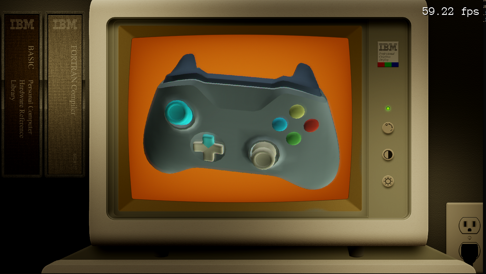
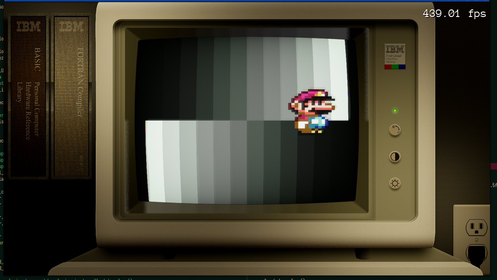
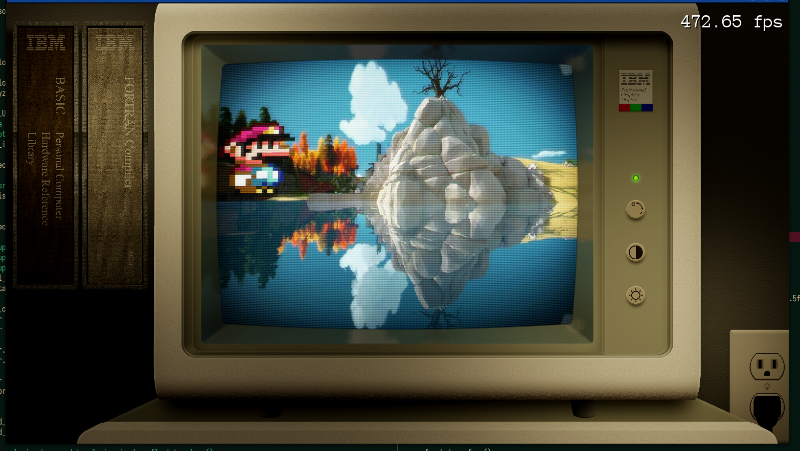
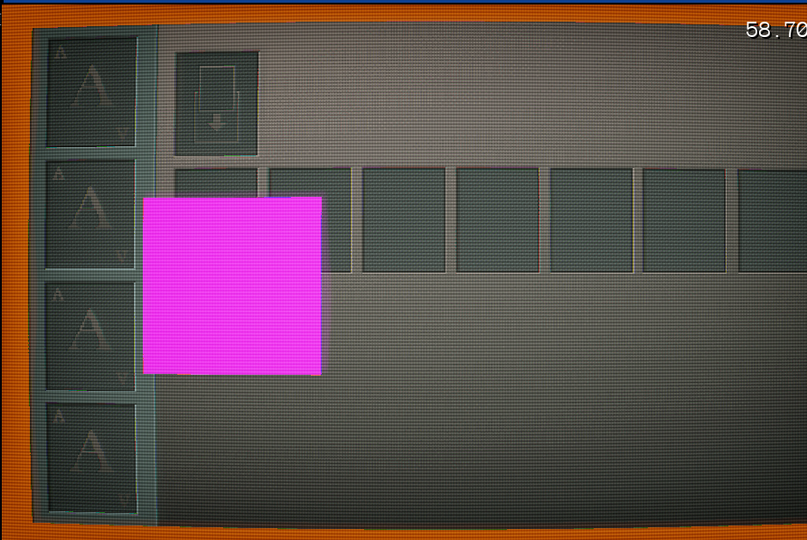

# CRT shader demo.

This demo uses a multipass post-processing technique to achieve ghosting, variable scanlines, and fluorescent glow effects like that found on vintage CRT monitors.

Here are some of the images:

